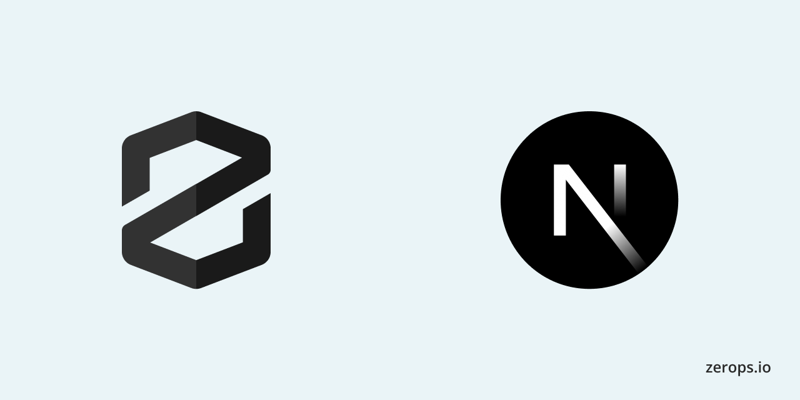

# Zerops + Next.js



A Node.js Next.js example for Zerops

**Features**

- Next.js 14 (App Router)

## Import

```yaml
project:
  name: nextjs-example

services:
  - hostname: prod
    type: nodejs@20
    buildFromGit: https://github.com/fxck/next-example-with-stage
    enableSubdomainAccess: true

services:
  - hostname: stage
    type: nodejs@20
    buildFromGit: https://github.com/fxck/next-example-with-stage
    enableSubdomainAccess: true
```
